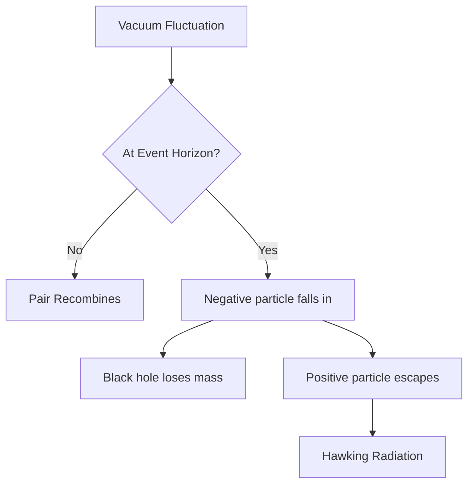

> [!entry]
> Atlas · Notes · Theme Reference

# Deepfield Theme Test

A complete reference for every element the Deepfield theme and component snippet styles. Use this to verify the theme is rendering correctly after updates.

---

## Text Formatting

Plain body text at normal weight. **Bold text stands out.** *Italic leans in.* ***Bold italic together.*** ~~Strikethrough.~~ ==Highlighted text.== And `inline code` for technical terms.

A [[wikilink]] and an [[wikilink|aliased display name]] and an [external link](https://obsidian.md).

---

## Headings

# H1 — Primary Title
## H2 — Section Header


### H3 — Subsection
The vacuum is therefore an active place with complex structure. There is no way to isolate a region of space and leave it perfectly empty.
#### H4 • Sub-subsection
Particles can be thought of as excitations of the vacuum — ripples in a sea that always ripples.
##### H5 · Minor Detail
Vacuum fluctuations are not a theoretical curiosity. They are directly observable.
###### H6 · Fine Print
See also: spontaneous emission, Casimir effect, Lamb shift.

---

## Blockquote

> "Vacuum fluctuations tickle the black hole, causing it to lose energy by emitting particles."
> — Cox & Forshaw, *Black Holes*

---

## Built-in Callouts

> [!note] Note
> Standard informational callout.

> [!warning] Warning
> Proceed carefully. This action may have consequences.

> [!abstract] Abstract
> Summary of findings before the full detail.

---

## Deepfield Callouts

> [!origin]
> Supernova Remnant

> [!entry]
> A Field Guide · Entry 02

> [!attribution] Proof · Cambridge · 1974
> Stephen Hawking
>
> Every black hole leaks energy at its outer edge. Slowly · Unstoppably

> [!punchline]
> Slowly · Unstoppably

> [!hud] TIER_07 · COSMIC_HORIZON_CLASS
> We may be inside one. The math of how a sphere collapses under its own gravity and the math of how a universe expands return the same equation. 
> 
> We do not have the words yet.

> [!horizon] Event Horizon · r_s = 2GM/c²

> [!bracket] XY_0.53 · 258.6958 · TIER_02
> Stellar-mass black holes form when a massive star runs out of fuel and collapses under its own gravity. Anything heavier than roughly three suns cannot stop falling.

> [!transition] ×10¹⁹
> Ten billion billion heavier
> 
> Tier 01 · Primordial · M ≤ 10¹² kg → Tier 02 · Stellar-Mass · M ≈ 10³¹ kg

> [!prose]
> There are roughly 100 million of them in the Milky Way alone.
>
> Mostly invisible.
>
> They reveal themselves only when they pull material off a companion star or when two of them collide.
>
> We have never seen one evaporate.

---

## Inline Components

**LED indicators:**
<span class="deepfield-led on"></span> Tier_02 · Stellar-Mass · Confirmed
<span class="deepfield-led warn"></span> Tier_05 · Ultramassive · Formation unknown
<span class="deepfield-led"></span> Tier_06 · Stupendously Large · Unconfirmed
<span class="deepfield-led"></span> Tier_07 · Cosmic-Horizon · No physics yet

**Code badges:**
<span class="deepfield-code-badge"><span class="deepfield-code-badge-main">T7</span><span class="deepfield-code-badge-sub">Cosmic</span></span><span class="deepfield-code-badge"><span class="deepfield-code-badge-main">07</span><span class="deepfield-code-badge-sub">Tiers</span></span><span class="deepfield-code-badge"><span class="deepfield-code-badge-main">E8</span><span class="deepfield-code-badge-sub">Hawking</span></span>

**Progress bars:**

<div class="deepfield-bar"><div class="deepfield-bar-label"><span>Confirmed_Tiers</span><span>4 / 7</span></div><div class="deepfield-bar-track"><div class="deepfield-bar-fill" style="width:89%"></div></div></div>

<div class="deepfield-bar"><div class="deepfield-bar-label"><span>Papers_Read</span><span>0 / 17</span></div><div class="deepfield-bar-track"><div class="deepfield-bar-fill" style="width:0%"></div></div></div>

**Scan line:**

<div class="deepfield-scan"><div class="deepfield-scan-rule"></div></div>

---

## Lists

- Unordered item one
- Unordered item two
	- Nested item A
	- Nested item B
- Third item

1. Step one — establish the problem
2. Step two — identify the mechanism
3. Step three — verify the result

---

## Task List

- [x] Watch PBS Space Time — AdS/CFT episode
- [x] Read *Black Holes* by Cox & Forshaw through Chapter 10
- [ ] Read Maldacena 1998 (AdS/CFT primary source)
- [ ] Read Hawking 1975 (Particle Creation by Black Holes)
- [ ] Read Guth 1981 (The Inflationary Universe)

## Custom Checkbox States

These use Obsidian's `data-task` mechanism — any character in the brackets renders a styled marker. Each gets its own glyph and color.

- [x] Completed — done and verified
- [/] In Progress — currently working
- [-] Cancelled — will not do
- [>] Deferred — moved to later
- [!] Important — high priority

---

## Table — All Seven Tiers

<table class="deepfield-tier-table">
<tr><td>01</td><td>Primordial Micro</td><td>≤ 10¹² kg</td><td><span class="tier-theory">Theoretical</span></td></tr>
<tr><td>02</td><td>Stellar-Mass</td><td>3–100 M☉</td><td><span class="tier-confirmed">Confirmed</span></td></tr>
<tr><td>03</td><td>Intermediate-Mass</td><td>100–100K M☉</td><td><span class="tier-partial">~50 Candidates</span></td></tr>
<tr><td>04</td><td>Supermassive</td><td>1M–9B M☉</td><td><span class="tier-imaged">Imaged</span></td></tr>
<tr><td>05</td><td>Ultramassive</td><td>9B–100B M☉</td><td><span class="tier-partial">TON 618</span></td></tr>
<tr><td>06</td><td>Stupendously Large</td><td>100B–10¹⁵ M☉</td><td><span class="tier-unknown">Unconfirmed</span></td></tr>
<tr><td>07</td><td>Cosmic-Horizon Class</td><td>r = 13.7B ly</td><td><span class="tier-unknown">No physics yet</span></td></tr>
</table>

---

## Section Divider

> [!divider] SECTION_END · 0347.001

---

## Code Block

```typescript
const hawkingTemperature = (mass: number): number => {
  // T_H = ℏc³ / 8πGMk_B
  const hbar = 1.055e-34;
  const G    = 6.674e-11;
  const k_B  = 1.38e-23;
  return (hbar * (3e8 ** 3)) / (8 * Math.PI * G * mass * k_B);
};
```

---

## Math

$$T_H = \frac{\hbar c^3}{8\pi G M k_B}$$

---

## Mermaid Diagram



---

## Embed

A section embed renders inside a left-bar container with a mono uppercase title:

![[The Quantum Vacuum#The Core Idea]]

---

## Tags

Tags render as bracket-wrapped `[#tag]` markers, inline and below:

This note touches #physics and #astronomy directly in a sentence.

#physics #quantum-mechanics #hawking-radiation #deepfield 

---

*Deepfield Theme · [github.com/nbost130/deepfield](https://github.com/nbost130/deepfield)*
