# Deepfield

A dark, sci-fi editorial theme for [Obsidian](https://obsidian.md). Named for the Hubble Deep Field.

Sparse typography. Blue glow. Technical precision. Inspired by the visual language of space-documentary filmmaking — wide-tracked monospace section headers, hard corners, and data that reads like a mission-control readout.

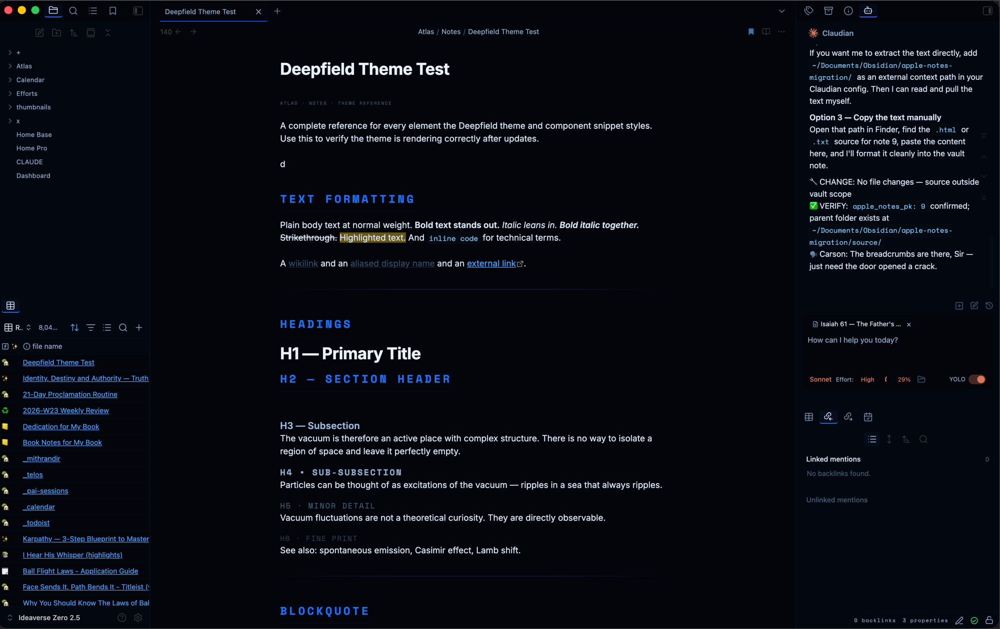

---

## Why Deepfield

Most dark themes are either neutral-grey or neon. Deepfield is **editorial** — it treats a note like a printed field guide. Section headers are tracked monospace caps. Tags read as `[#hash]` markers. Tasks carry distinct glyphs per state. Everything is square — no border radius anywhere — and a single blue accent runs through links, borders, and code.

- **20 color palettes**, switchable live, including **8 planet themes derived from real spectral data**
- **Dark *and* light modes** — palette accents carry into both
- **Custom callout components** — attribution blocks, HUD panels, scan-line dividers, and more, via native callout syntax
- **Distinct task-state glyphs** — `[/]` `[-]` `[>]` `[!]` each get their own symbol and color
- Built on [Minimal](https://github.com/kepano/obsidian-minimal)'s variable system; works standalone too

---

## Install

### Community Themes (recommended)

Settings → Appearance → Themes → Browse → search **Deepfield** → Install → Use.

### Manual

1. Download this repo
2. Copy the `Deepfield/` folder into your vault's `.obsidian/themes/`
3. Settings → Appearance → Themes → select **Deepfield**

For the full experience also install:
- **[Style Settings](https://github.com/mgmeyers/obsidian-style-settings)** — required for the color-palette switcher
- **`deepfield-components.css`** (in this repo) — copy to `.obsidian/snippets/`, enable under Settings → Appearance → CSS Snippets. Adds the custom callout + inline components.

---

## Color Palettes

With **Style Settings** installed, go to **Settings → Style Settings → Deepfield → Color Palette**. The accent updates live across links, borders, tags, code, checkboxes, and headings — in both light and dark mode.

| Group | Palettes |
|-------|----------|
| **Blues** | Electric (default) · Steel · Slate · Midnight |
| **Planets** *(spectral)* | Mercury · Venus · Earth · Mars · Jupiter · Saturn · Uranus · Neptune |
| **Space** | Event Horizon · Galactic Noir · Midnight Orbit · Ion Trail · Aurora Nebula · Magnetic Field · Retro Galaxy · Vintage Cosmos |

### The planet palettes are real science

Each planet's accent is derived from the dominant wavelength of light it actually reflects:

| Planet | Accent basis |
|--------|--------------|
| Mercury | Spectrally neutral silicate surface, peak ~500 nm |
| Venus | Sulfuric-acid cloud albedo, UV absorber at 340 nm |
| Earth | Rayleigh scattering, ocean blue dominant ~450 nm |
| Mars | Ferric iron (Fe₂O₃ / hematite), reflectance peak ~750 nm |
| Jupiter | Red chromophore absorbing blue 300–500 nm |
| Saturn | Ammonia-ice reflectance peak 550–600 nm |
| Uranus | Methane absorption 700–900 nm, reflects ~480 nm |
| Neptune | Stronger methane than Uranus; only ~440 nm escapes |

---

## Typography

- **Inter** — body text and H1/H3 headings
- **Space Mono** — H2 and all H4–H6 (tracked uppercase), plus every data label, tag, coordinate, and code block

H2 renders as a wide-tracked monospace caps header with a thin accent rule beneath it. H4–H6 step down through mono-caps at decreasing weight and tracking, so deep hierarchy stays legible.

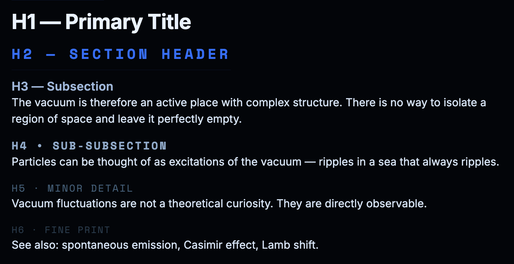

---

## Standard Markdown

Everything Obsidian renders gets the Deepfield treatment:

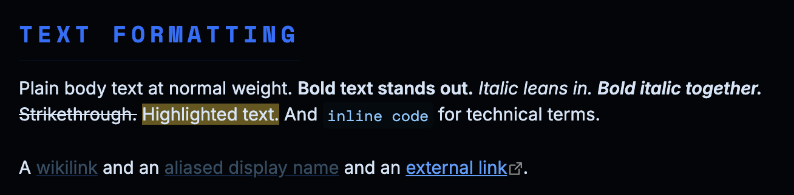

- **Headings** H1–H6 with the type hierarchy above
- **Blockquotes** as left-bar panels with a faint accent fill
- **Built-in callouts** (note, warning, abstract, …) — square corners, mono-caps titles
- **Tables** — mono-caps accent headers, faint row borders, subtle even-row striping
- **Code** — square inline + block, accent-tinted, syntax colors tuned to the palette
- **Tags** — `[#tag]` bracket-wrapped, mono uppercase, accent brackets (works in reading view *and* Live Preview)
- **Lists** — accent markers, open circles at nested depth
- **Task lists** — square checkbox, translucent accent fill + glow when checked
- **Highlights** (`==text==`) — accent-tinted, not default yellow
- **Embeds** (`![[note]]`) — left-bar container with a mono-caps title
- **Properties / frontmatter** — left-bar panel, mono-caps keys
- **Mermaid** — dark nodes, accent strokes, light labels
- **Math** (KaTeX) and **footnotes** styled to match

**Lists** — accent markers, open circles at nested depth:

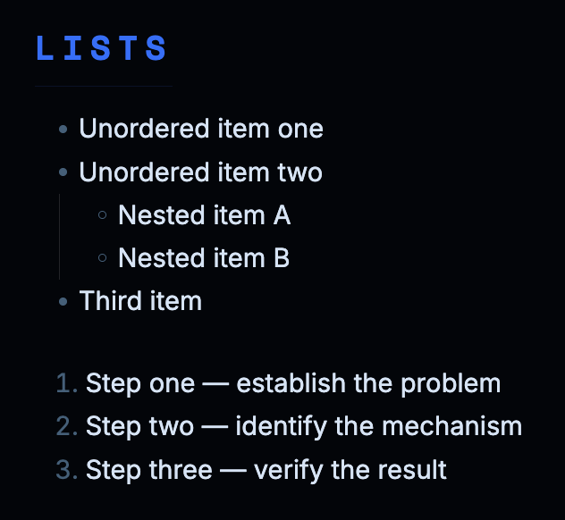

**Tables** — mono-caps accent headers, faint borders, color-coded status cells:

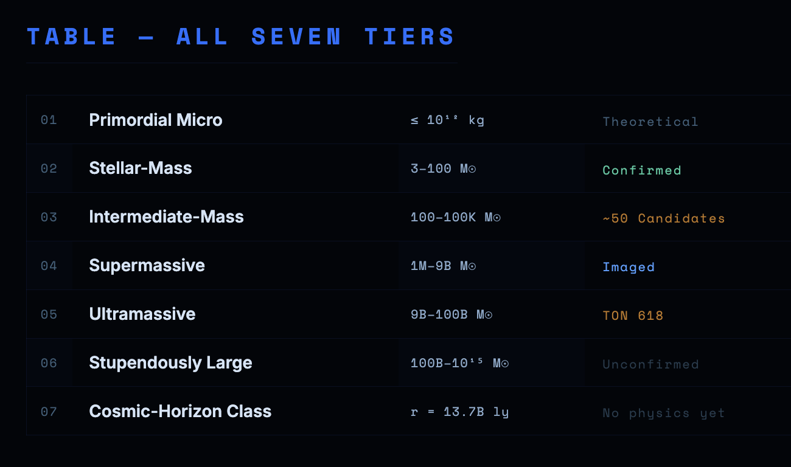

**Code** — square block, syntax colors tuned to the palette:

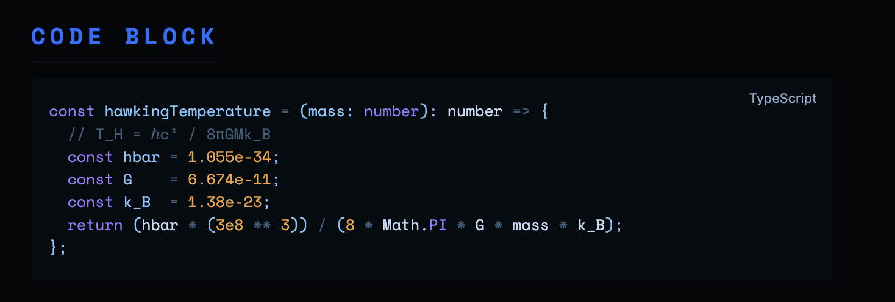

**Tags** — `[#tag]` bracket-wrapped, mono uppercase, accent brackets (reading view *and* Live Preview):

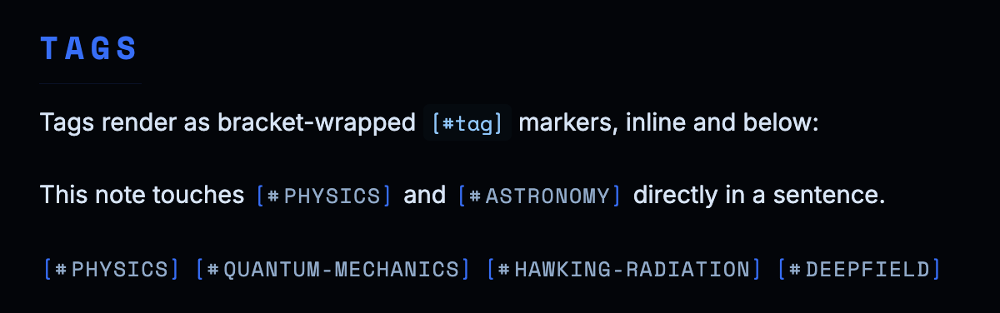

**Section divider** — the `[!divider]` callout, a scan line with centered text:

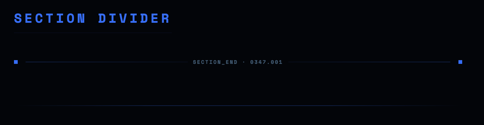

### Custom task states

Beyond `[ ]` and `[x]`, Deepfield gives each task state its own glyph and color:

| Syntax | State | Glyph · color |
|--------|-------|---------------|
| `- [x]` | Completed | check · accent (glow) |
| `- [/]` | In progress | dot · amber |
| `- [-]` | Cancelled | minus · faint (strikethrough) |
| `- [>]` | Deferred | arrow · purple |
| `- [!]` | Important | triangle · red |

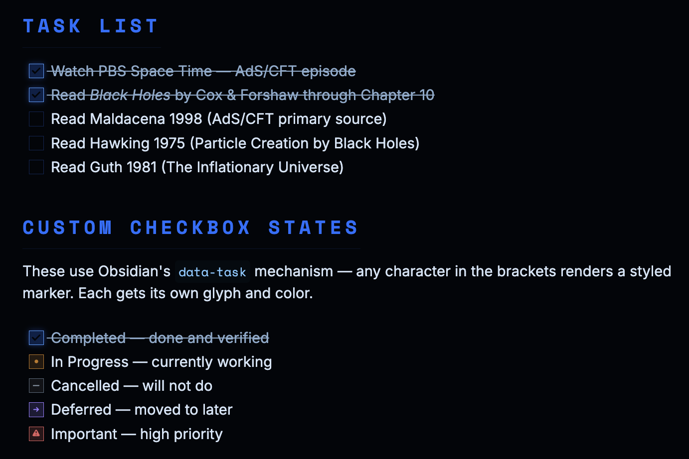

---

## Custom Components

Enable `deepfield-components.css` as a snippet. Block components use **native callout syntax** (so they work in reading and live preview); inline components use small HTML spans.

### Callouts

```markdown
> [!attribution] Proof · Cambridge · 1974
> Stephen Hawking
>
> Every black hole leaks energy. Slowly · Unstoppably

> [!hud] TIER_07 · COSMIC_HORIZON_CLASS
> We do not have the words yet.

> [!punchline]
> Slowly · Unstoppably

> [!origin]
> Supernova Remnant

> [!bracket] XY_0.53 · 258.6958 · TIER_02
> Stellar-mass black holes form when a massive star runs out of fuel.

> [!transition] ×10¹⁹
> Ten billion billion heavier
>
> Tier 01 · Primordial → Tier 02 · Stellar-Mass

> [!horizon] Event Horizon · r_s = 2GM/c²

> [!divider] SECTION_END · 0347.001

> [!prose]
> One declarative sentence per line.
>
> Mostly invisible.
```

| Callout | Renders as |
|---------|-----------|
| `attribution` | Proof block — metadata · name · descriptor |
| `hud` | Left-bar panel with a mono coordinate header |
| `punchline` | Dot-separated accent caps |
| `origin` | Small bracketed origin tag |
| `bracket` | Corner-bracket container with a coordinate label |
| `transition` | Scale-jump card (large multiplier + subtitle) |
| `horizon` | Dashed event-horizon ring + label |
| `divider` | Scan-line divider with centered text |
| `entry` | Field-guide entry designation |
| `prose` | One-sentence-per-line column |

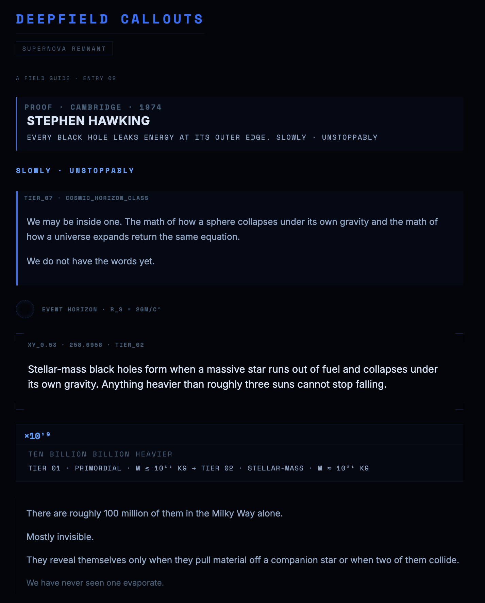

### Inline components

```html
<!-- LED status -->
<span class="deepfield-led on"></span> Confirmed
<span class="deepfield-led warn"></span> Uncertain
<span class="deepfield-led"></span> Unobserved

<!-- Progress bar -->
<div class="deepfield-bar"><div class="deepfield-bar-label"><span>Confirmed</span><span>4 / 7</span></div><div class="deepfield-bar-track"><div class="deepfield-bar-fill" style="width:57%"></div></div></div>

<!-- Code badge -->
<span class="deepfield-code-badge"><span class="deepfield-code-badge-main">T7</span><span class="deepfield-code-badge-sub">Cosmic</span></span>

<!-- Scan line -->
<div class="deepfield-scan"><div class="deepfield-scan-rule"></div></div>
```

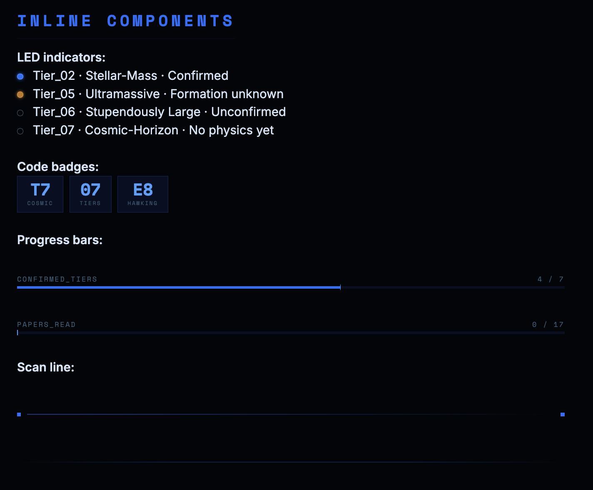

A full live reference of every element is in [`EXAMPLE.md`](EXAMPLE.md) — drop it in a vault with the theme + snippet active.

---

## Light Mode

Deepfield ships a **"Daylight Readout"** light variant — cool-neutral paper, slate ink, blue accent held. Toggle via Settings → Appearance → Base color scheme, or follow your OS. Palette accents carry into light mode too. The blue-family palettes (Electric, Steel, Midnight, Neptune, Earth) are tuned for strong contrast in both modes.

---

## Attribution

**Visual aesthetic** inspired by [Caelum](https://www.youtube.com/@Caelum_Space) — specifically [*The 7 Levels of Black Holes*](https://www.youtube.com/watch?v=ge4SzvdO1iI). The dark editorial typography, monospace section headers, dot separators, and data-annotation style are drawn from their visual language.

**Space color palettes** sourced from [Filmora's Space Color Palette guide](https://filmora.wondershare.com/video-creative-tips/space-color-palette.html).

**Planet palettes** derived from published planetary spectral / reflectance data (see the table above).

**Architecture** builds on patterns from [kepano/obsidian-minimal](https://github.com/kepano/obsidian-minimal) (HSL variable system) and [mgmeyers/obsidian-style-settings](https://github.com/mgmeyers/obsidian-style-settings) (palette switcher). Custom-callout distribution follows Nick Milo's [ITS Theme](https://github.com/SlRvb/Obsidian--ITS-Theme) approach.

---

## License

MIT — see [LICENSE](LICENSE).
